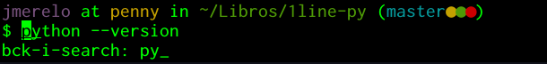
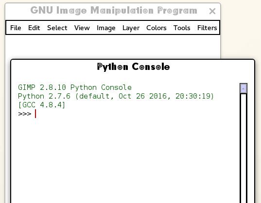
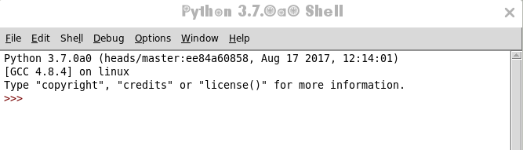
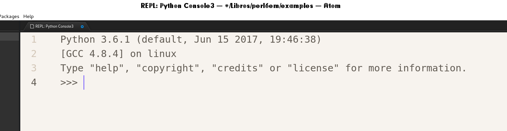
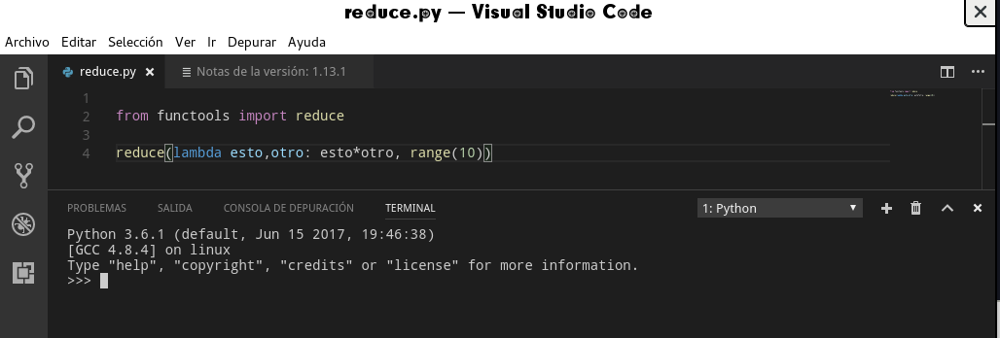

# Para empezar a trabajar

Necesitas Python, claro. Python tiene dos versiones en desarrollo: la
2 y la 3. Aunque en un 90% el código que vamos a usar funcionará
correctamente en las dos versiones, vamos a trabajar con la
versión 3. Es muy posible que ya tengas instalado algún programa que
necesite python. Escribe

	python --version

en tu línea de órdenes para ver qué versión tienes instalada. Si
tienes la versión 3, estás listo para hacer los ejercicios del resto del libro. Si no, continúa leyendo después del
interludio siguiente donde te explicaremos cómo trabajar con la línea
de órdenes de tu sistema operativo, algo que nos va a servir durante el
resto del libro. 

## Trabajando con la línea de órdenes.

La mayoría de los desarrolladores usan ordenadores con el sistema operativo Linux o Macs para trabajar. Es
posible que tú no lo uses, pero no tienes que preocuparte, porque
puedes trabajar
[de la misma forma en Windows](https://www.xataka.com/aplicaciones/asi-es-usar-la-consola-bash-de-ubuntu-en-windows-10). En
las últimas actualizaciones todavía es más fácil,
pudiendo
[descargártela desde la Windows Store](https://www.xataka.com/aplicaciones/ubuntu-llega-a-la-windows-store-y-el-matrimonio-microsoft-linux-esta-en-su-mejor-momento),
aunque pare esto tendrás que estar dentro de un programa que se
denomina *Windows Insider*, por lo que posiblemente sea más fácil
activar el subsistema Ubuntu como se indica en el primer enlace. Esta
línea de órdenes de Linux presenta una serie de ventajas, como poder
trabajar con [temas](https://github.com/Bash-it/bash-it/wiki/Themes)
que hacen de tu experiencia algo mucho más agradable, como esto:


En cualquier caso, conviene que conozcas algunas cosas básicas del
intérprete `bash` para ejecutar estos programas
de una sola línea o simplemente para entrar en Python y empezar a
ejecutar cosas. Por ejemplo, estos trucos básicos

* Te puedes mover por la línea con las flechas, pero también de
  palabra en palabra con control →. Control-a te llevará al principio
  de la línea (a es el principio del alfabeto), control-e al final de
  la línea (*end*, en inglés)

* Puedes borrar la línea entera con control-k. Para copiar y pegar,
  mayúsculas-control-c y mayúsculas-control-v. Igual que en cualquier
  otro lado, sólo que con el *mayúsculas* por delante.

* ↑ te permitirá acceder a las órdenes anteriores que has ejecutado y
  editarlas. También con control-r podrás comenzar a buscar por
  algunos caracteres que estén en la línea. Por ejemplo, `ctrl-r` +
  `py` te encontrará la última orden en la que se ha hecho esto.



* Usa siempre el tabulador para completar. En la primera palabra de la
  orden te completará el nombre de la misma, en el resto te completará
  nombres de ficheros y demás. Usa el tabulador y te ahorrarás teclear
  un montón. Dependiendo del intérprete que uses, te aparecerán
  diferentes opciones que podrás seleccionar con el cursor.

La línea de órdenes, que en realidad se denomina *consola* o
*terminal*, que se usa en los Mac y Linux es la misma, y tiene
una buena cantidad. Usa [el buscador DuckDuckGo con su servicio de chuletas integrado](https://duckduckgo.com/?q=linux+cheatsheet&t=canonical&ia=cheatsheet) para
encontrarla. Las primeras órdenes, `ls`, `rm`, `mkdir`, `cd` van a ser las
que vas a necesitar con
seguridad. Mira
[la chuleta completa](https://duckduckgo.com/?q=linux+cheatsheet&t=canonical&ia=cheatsheet&iax=1) para
ver una buena cantidad de órdenes interesantes, alguna de las cuales
te puede sacar de un apuro en un momento determinado. Y una vez que la
uses, está almacenada en tu historia y puedes volver a ella usando,
como hemos visto antes, control-r.

## Instalando Python

Instálatela de la forma habitual

	sudo apt install python3 #Ubuntu
	apk add python #Alpine Linux
	brew  install python3 #OSX
	choco install python &REM Windows

o

	Install-Package python -Version 3.6.0

Si usas
el [Package Manager](https://www.nuget.org/packages/python/3.6.0) de
NuGet para Windows o [`chocolatey`](https://chocolatey.org/), el otro
gestor de paquetes para Windows. Ninguno de los dos vienen instalados
en la versión básica, por lo que tendrás que instalártelos antes. Por
supuesto, también puedes
descargarte un instalador de 
[Python para Windows](https://www.python.org/downloads/windows/) de la web.

## Usando `pyenv`

Si quieres trabajar con una versión diferente de la que viene con tu
sistema operativo, no tienes permisos de administrador para trabajar
con él, o simplemente para gestionar de forma ágil las
versiones de Python que tienes, aconsejamos `pyenv`, una herramienta
para seleccionar la versión de Python que
tenemos. Usa [esta línea](https://github.com/pyenv/pyenv-installer)
desde Linux

```bash
curl -L https://git.io/install-pyenv | bash
```

Si eres usuario de docker y no de Python, puedes usar también los
[contenedores oficiales](https://hub.docker.com/_/python/) para
ejecutar lo que sea, inclusive la línea de órdenes que vamos a usar
más adelante.

## Usando virtualenv

Si quieres trabajar en un entorno en el cual los paquetes que instales están
aislados de los que están instalados por defecto, se puede utilizar
lo que es conocido como `virtualenv`. Con `virtualenv` se puede tener entornos
con módulos que solo están ligados a dicho entorno y no
afectan al resto del sistema; la principal diferencia con `pyenv` es que en este los módulos se instalan para todos los programas del usuario. En producción será bastante más útil `virtualenv` y conviene conocerlo, pero para el resto de este tutorial es suficiente con las formas de instalación indicadas anteriormente. 

Para instalar se utiliza el gestor de módulos en python conocido como `pip`:

```sh
$ [sudo] pip install virtualenv
```

Con esto podemos tener entornos aislados, resolviendo problemas de dependencias, versiones,
y permisos. Más información sobre virtualenv [en su web](https://virtualenv.pypa.io/en/stable/). 

## Trabajando desde cualquier lugar

Si simplemente quieres ir probando cosas desde tu tablet o un ordenador accesible públicamente, puedes usar [repl.it](https://repl.it/languages/python3), un recurso en la web con REPLs (bucle lee, evalúa, imprime) para un montón de lenguajes, incluyendo Python 2 y 3 y muchos otros lenguajes de los que vamos a usar ejemplos en este tutorial. 

> *Ejercicio*: regístrate en `repl.it` usando tu cuenta de Google, Facebook o GitHub. Si no estás registrado en GitHub, quizás sea un buen momento para hacerlo. 

Python, de hecho, está *empotrado* en muchas aplicaciones, como un
lenguaje que sirve para escribir *plugins* o extensiones. Tal vez  

## Python está en tus programas habituales.



En Gimp, por ejemplo, se puede usar
para
[escribir extensiones](https://www.ibm.com/developerworks/library/os-autogimp/index.html) que
manipulan directamente la imagen, y además el propio programa incluye
una consola de Python, aunque de la versión 2. LibreOffice también
permite escribir programas con él si se instala la extensión
correspondiente,
y
[muchas aplicaciones de escritorio y juegos](https://wiki.python.org/moin/AppsWithPythonScripting) permiten
hacerlo de diferente forma.

Si no tienes ninguna otra cosa, ni Internet, pero sí una copia de
Gimp, ¡tienes Python! Si tienes de todo, tener Python empotrado en las
aplicaciones te permite diferentes campos de juego y posibilidades
creativas. 


## Trabajando con un editor

Aunque sea sólo por el hecho de poder llevar un pequeño diario de lo
que has hecho, es conveniente que trabajes con Python desde un
editor. La distribución de Python incluye un entorno de desarrollo
llamado IDLE. Escribiendo `idle` en un terminal, o desde la selección
de órdenes de tu sistema operativo, te aparecerá la ventana
correspondiente, que se abre directamente en un terminal de Python
donde se pueden ejecutar las órdenes o evaluar expresiones. 



La mayoría de los editores te permiten trabajar con el
lenguaje que quieras en una de las ventanas mientras tienes el código
en otra. Si usas `emacs`, el editor viene integrado. Si usas Atom,
escribe

```bash
apm install Repl
```

para que te instale un REPL, o línea de órdenes, que se puede usar
para diferentes lenguajes.



En cualquier caso conviene conocer y usar, dentro de lo posible, un
editor para trabajar con cualquier lenguaje. Los editores como los
mencionados tienen un modo específico para cada lenguaje, que depende
de la extensión del mismo, que te permite
desde
[completar código](https://code.visualstudio.com/docs/languages/python) usando
la sintaxis del lenguaje hasta
presentarlo con colores de forma que la estructura del programa sea
más fácil de entender. En algunos casos, como en el de Visual Studio
Code (VSCode), el editor y entorno de programación libre de Microsoft, tendrás
que instalar una extensión específica para poder trabajar con este
entorno de línea de órdenes.



Hay varias extensiones de VSCode para Python; la más popular se llama
simplemente
[Python](https://marketplace.visualstudio.com/items?itemName=donjayamanne.python). Con
esta extensión se instalan una serie de órdenes para trabajar con
Python, incluyendo un REPL: Usando
mayúsculas-control-P para seleccionar las órdenes que se van a
ejecutar y buscando "REPL" aparecerá *Python: Start REPL* que
arrancará una ventana de órdenes tal como la que aparece más arriba en
la imagen. Si usas otros editores,
como
[Visual Estudio, se le denomina "Ventana interactiva"](https://docs.microsoft.com/en-us/visualstudio/python/interactive-repl) y
viene de serie con el mismo. 

## Concluyendo

Después de este capítulo deberías de tener instalado algún entorno con
el que poder trabajar con Python, aparte de ser capaz de ejecutar `python`
desde la línea de órdenes. Escoge el que más te guste, o instálatelos
todos. Son software libre y es lo que tienen.
