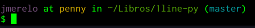

# Para empezar a trabajar

Necesitas Python, claro. Python tiene dos versiones en desarrollo: la
2 y la 3. Aunque en un 90% el código que vamos a usar funcionará
correctamente en las dos versiones, vamos a trabajar con la
versión 3. Es muy posible que ya tengas instalado algún programa que
necesite python. Escribe 

	python --version

en tu línea de órdenes para ver qué versión tienes instalada. Si
tienes la versión 3, estás listo. Si no, continúa leyendo después del
interludio siguiente.

## Trabajando con la línea de órdenes.

La mayoría de los desarrolladores usan Linux o Mac para trabajar. Es
posible que tú no lo uses, pero no tienes que preocuparte, porque
puedes
trabajar
[de la misma forma en Windows](https://www.xataka.com/aplicaciones/asi-es-usar-la-consola-bash-de-ubuntu-en-windows-10). En
las últimas actualizaciones todavía es más fácil,
pudiendo
[descargártela desde la Windows Store](https://www.xataka.com/aplicaciones/ubuntu-llega-a-la-windows-store-y-el-matrimonio-microsoft-linux-esta-en-su-mejor-momento). Esta
línea de órdenes de Linux presenta una serie de ventajas, como poder
trabajar con [temas](https://github.com/Bash-it/bash-it/wiki/Themes)
que hacen de tu experiencia algo mucho más agradable, como esto:



En cualquier caso, tendrás que trabajar para ejecutar estos programas
de una sola línea o simplemente para entrar en Python y empezar a
ejecutar cosas. Conviene que conozcas unos cuantos trucos básicos

* Te puedes mover por la línea con las flechas, pero también de
  palabra en palabra con control →. Control-a te llevará al principio
  de la línea (a es el principio del alfabeto), control-e al final de
  la línea (*end*, en inglés)

* Puedes borrar la línea entera con control-k. Para copiar y pegar,
  mayúsculas-control-c y mayúsculas-control-v. Igual que en cualquier
  otro lado, sólo que con el *mayúsculas* por delante. 
  
* ↑ te permitirá acceder a las órdenes anteriores que has ejecutado y
  editarlas. También con control-r podrás comenzar a buscar por
  algunos caracteres que estén en la línea. Por ejemplo, `ctrl-r` +
  `py` te encontrará la última orden en la que se ha hecho esto.


* Usa siempre el tabulador para completar. En la primera palabra de la
  orden te completará el nombre de la misma, en el resto te completará
  nombres de ficheros y demás. Usa el tabulador y te ahorrarás teclear
  un montón. Dependiendo del intérprete que uses, te aparecerán
  diferentes opciones que podrás seleccionar con el cursor.
  
La línea de órdenes que se usa en los Mac y Linux es la misma, y tiene
una buena cantidad. Usa [el buscador DuckDuckGo con su servicio de chuletas integrado](https://duckduckgo.com/?q=linux+cheatsheet&t=canonical&ia=cheatsheet) para
encontrarla. Las primeras órdenes, `ls`, `rm`, `mkdir`, `cd` van a ser las
que vas a necesitar con
seguridad. Mira
[la chuleta completa](https://duckduckgo.com/?q=linux+cheatsheet&t=canonical&ia=cheatsheet&iax=1) para
ver una buena cantidad de órdenes interesantes, alguna de las cuales
te puede sacar de un apuro en un momento determinado. Y una vez que la
uses, está almacenada en tu historia y puedes volver a ella usando,
como hemos visto antes, control-r. 

## Instalando Python

Instálatela de la forma habitual

	sudo apt-get install python3 #Ubuntu
	brew  install python3 #OSX
	choco install python &REM Windows

o 

	Install-Package python -Version 3.6.0

Si usas
el [Package Manager](https://www.nuget.org/packages/python/3.6.0) de
NuGet.

## Usando `pyenv`

Si quieres trabajar con una versión diferente de la que viene con tu
sistema operativo, no tienes permisos de administrador para trabajar
con él, o simplemente para gestionar de forma ágil las
versiones de Python que tienes, aconsejamos `pyenv`, una herramienta
para seleccionar la versión de Python que
tenemos. Usa [esta línea](https://github.com/pyenv/pyenv-installer)
desde Linux

	curl -L https://raw.githubusercontent.com/pyenv/pyenv-installer/master/bin/pyenv-installer | bash

Si eres usuario de docker y no de Python, puedes usar también los
[contenedores oficiales](https://hub.docker.com/_/python/) para
ejecutar lo que sea, inclusive la línea de órdenes que vamos a usar
más adelante.

## Trabajando con un editor

Aunque sea sólo por el hecho de poder llevar un pequeño diario de lo
que has hecho, es conveniente que trabajes con Python desde un
editor. La mayoría de los editores te permiten trabajar con el
lenguaje que quieras en una de las ventanas mientras tienes el código
en otra. Si usas `emacs`, el editor viene integrado. Si usas Atom,
escribe

```
apm install Repl
```

para que te instale un REPL, o línea de órdenes, que se puede usar
para diferentes lenguajes. 


En cualquier caso conviene conocer y usar, dentro de lo posible, un
editor para trabajar con cualquier lenguaje. Los editores como los
mencionados tienen un modo específico para cada lenguaje, que depende
de la extensión del mismo, que te permite
desde
[completar código](https://code.visualstudio.com/docs/languages/python) usando
la sintaxis del lenguaje hasta
presentarlo con colores de forma que la estructura del programa sea
más fácil de entender. En algunos casos, como en el de Visual Studio
Code, el editor y entorno de programación libre de Microsoft, tendrás
que instalar una extensión específica para poder trabajar con este
entorno de línea de órdenes.


## Concluyendo

Después de este capítulo deberías de tener instalado algún entorno con
el que poder trabajar con Python y ser capaz de ejecutar `python`
desde la línea de órdenes. Escoge el que más te guste, o instálatelos
todos. Son software libre y es lo que tienen. 
