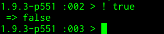

# Lo que es verdad y lo que no lo es

Toda la computación se basa en lo que es verdad o no. Un *bit* de
información sólo puede tener dos valores: verdadero o falso, 1 o 0,
algo o nada. Y esta simple lógica se usa de base para muchas otras
operaciones en informática: tomar decisiones, decidir qué es parte de
un conjunto y qué no lo es, y, en realidad, dado que toda la
información está almacenada, allí abajo, en forma de bits, de toda la
informática en general.

Pero a más alto nivel, a los tipos que almacenan una simple dicotomía
verdadero/falso se les denomina Booleanos, por el *álgebra de Boole*,
algo que ha servido para que generaciones de informáticos tengan que
sufrir esta asignatura en primero.

En Python, todo lo que parece un cero, nulo y falso, lo es. Esto, que
parece contradecir el principio de *explícito mejor que implícito*,
también se ajusta a otro, el de *lo práctico vence a la pureza*, lo
que viene a ser una excusa para hacer lo que a uno le dé la gana, pero
también se aplica de forma lógica (Booleana) a este caso.

Estos valores se pueden escribir explícitamente (primer principio) en
nuestro intérprete:

```python
>>> type(True)
type(True)
<class 'bool'>
```

De por sí, los tipos booleanos tampoco son tan útiles. Pero sí lo son
para hacer 

## Operaciones lógicas.

Conviene recordar que, para empezar, todo valor tiene un equivalente
lógico. Estas operaciones no se tienen por qué hacer, necesariamente,
sobre tipos `bool`. Por ejemplo

```python
not(3)
False
```

`not` cambia lo verdadero a falso y lo falso a verdadero, pero siempre
devolverá un booleano. 

```python
not(None)
True
```

Hay otras dos operaciones lógicas: `and` y `or`. `and` necesita que
sean ciertos los dos operandos:

```python
3 and ""
''
```

Para devolver un valor verdadero, que además será el segundo de los
operandos

```python
3.5 and "happy"
'happy'
```

Si el resultado es falso, devolverá el operando que tenga un valor que
equivalga a falso:

```python
"" and 3
''
```

En este caso, igual que en el primero, el valor devuelto es `''`, que
equivale a Falso. Con `or` sucederá algo similar:

```python
[] or 45
45
```

`or`eando un valor falso ([]) y otro verdadero, devolverá el que sea
verdadero, o el uno de ellos operando si los dos tienen el mismo tipo. A
`or` le basta con que sea cierto uno de los operandos, como se ve
arriba. 

>Curiosamente, `or` devuelve el segundo operando si el resultado es
>falso, y el primero si el resultado es True. Eso puede tener que ver
>con lo que se denomina "cortocircuito". En el caso de `and`, si el
>primer operando es falso, el resultado va a ser falso de todas
>formas. En el caso de `or`, aunque el primer operando sea falso, hay
>que evaluar también el segundo, pero si el primero es verdadero, el
>resultado va a ser verdadero, así que simplemente devuelven el último
>operando evaluado. 

Aunque estas operaciones se usan con asiduidad, las que tienen más
interés son las operaciones de comparación que dan un resultado
Verdadero o Falso. 

>*Ejercicio*: se dice que una fórmula es ["satisfacible"](https://es.wikipedia.org/wiki/Problema_de_satisfacibilidad_booleana) si es
>verdadera al menos para una combinación de valores. Con una fórmula
>de 3 variables, ¿cuantas combinaciones posibles de valores hay?
>Diseña una fórmula y pruébala sistemáticamente hasta que encuentres
>si es satisfacible o no. Altérala y conviértela en no-satisfacible,
>probándola también sistemáticamente. 

## Comparaciones no odiosas.

Algunas operaciones también devuelven un valor lógico: verdadero o falso. Un número es mayor o igual que otro, por ejemplo.

```
3 < 3.5
True
```

Un número es mayor o menor que otro, o menor o igual que otro, y lo mismo sucede con las cadenas

```
"alto" < "altos"
True
```

El orden que se sigue normalmente es parecido al alfabético, pero no
exactamente igual.  Se denomina orden *lexicográfico*. Es más o menos
como el alfabético, salvo que tiene en cuenta si se trata de
minúsculas o mayúsculas, el tamaño de las cadenas y también los
números.

```
"1" < "uno"
True
"menor" > "Mayor"
True
```

Desgraciadamente, al seguir el orden del alfabeto Unicode, donde los
caracteres latinos como la `ñ` y otros caracteres están más allá de los
caracteres del alfabeto inglés, también sucede que:

```
"leño" < "lesa"
False
```

La solución a
esto
[no es demasiado simple](https://stackoverflow.com/questions/1097908/how-do-i-sort-unicode-strings-alphabetically-in-python). Por
lo pronto simplemente conviene tratar de evitar la sorpresa cuando se
usen caracteres que no sean los 23 del alfabeto inglés. 

> *Ejercicio*: Escribe una expresión que sea cierta (es decir, sea `True`) si un número está en un intervalo comprendido entre dos números naturales.

Para comparar si dos cosas son iguales se usa `==` y sirve para todo
tipo de operandos.

```
"pepe" == "pepe"
True
1 == 0
False
```

La [filosofía de Python](https://www.python.org/dev/peps/pep-0020/)
afirma que debe haber una, y sólo una, manera de hacerlo. En este
caso, tener un único operador de igualdad para cualquier tipo es la
forma de lograrlo. Esa filosofía contrasta con la de otros
lenguajes. JavaScript, por ejemplo, diferencia [igualdad abstracta e igualdad estricta](https://developer.mozilla.org/es/docs/Web/JavaScript/Equality_comparisons_and_sameness) y
tiene un operador para cada una: `==` e `===`. El que se usen varios
signos `=` en vez de uno solo es porque este se suele reservar para
asignaciones, y es un error bastante habitual poner `x = y` en vez de
`x == y`. Algunos compiladores e intérpretes, incluso, avisan en
ciertas circunstancias del posible error. Son muy majetes. 

Para expresar desigualdad, `!=` es también símbolo cuasi-universal. En
Python se puede usar con cualquier tipo de dato. 

> *Ejercicio*: Usando sólo los símbolos de mayor y menor y operadores
> lógicos (`and` y `or`), construir
> una expresión que sea equivalente a `!=`. Probar con diferentes
> valores que efectivamente es así. 

## Dos veces no es si.

Los operadores que se sitúan entre dos operandos se llaman
binarios. `<=`, por ejemplo, es un operador binario

```
3 <= 3
True
```

Otros operadores sólo necesitan a un operando. El operador de
negación, que por alguna razón recibe en casi todos los lenguaje el símbolo
`!`, es uno de ellos. En Python,
por [aquello de](https://www.python.org/dev/peps/pep-0020/) que *la
legibilidad cuenta*, es `not`

```
not True
False
```

En otros lenguajes, como Ruby, sí se puede usar el símbolo
cuasi-universal del `!`

```Ruby
! true
```



En Python nos lo encontramos dentro de la comparación `!=`. ¿Por qué
no se usa `not`? [Porque *simple es mejor que complicado*](https://hipertextual.com/2011/02/zen-python) y `x != y`
es más simple que `not x == y`. 

> *Ejercicio*: probar, usando todos los casos posibles,
> las
> [leyes de De Morgan](https://es.wikipedia.org/wiki/Leyes_de_De_Morgan). ¿Cuál
> sería el *modo Python* de expresar una expresión de ese estilo?

Y llegados a este punto, conviene hablar otra vez de *precedencia*, es
decir, orden de evaluación del los operadores. En concreto, `not 0 and
1`, ¿a qué es igual? ¿A `(not 0) and 1`? ¿O a `not( 0 and 1)`)? En
general, la precedencia estará marcada por los paréntesis, luego la
tendrán los operadores unarios (como `-` precediendo a un número) y
finalmente los binarios, también por su orden. En los operadores
lógicos, `not` > `and` > `or`, por lo que si quieres negar una
expresión tendrás que ponerlo entre paréntesis.

Esto conviene tenerlo en cuenta cuando queremos crear operadores
combinados, como el siguiente: En electrónica, conviene expresar las operaciones lógicas usando el
mínimo número de *conectores* posibles. Y resulta que `NAND`, donde `a
NAND b == not (a and b)`, es suficiente para expresar absolutamente
todos los operadores lógicos unarios y binarios. En este caso el
paréntesis hace que se ejecute primero el `a and b` antes que el not;
la precedencia más alta del `not` obliga a que se haga de esta forma. 

> *Ejercicio*: expresar `and`, `or` y `not` usando sólo NAND y probar
> exhaustivamente, usando valores de True y False, que es así.

Al final, los lenguajes de programación son lenguajes que te permiten
expresar y resolver problemas. Enseñar a pensar usando ordenadores se
denomina 

## Pensamiento computacional,

y se basa
en
[tres pilares](https://es.wikipedia.org/wiki/Pensamiento_computacional):
*descomposición*, *reconocimiento de patrones* y *abstracción*.

La abstracción se basa, entre otras cosas, en saber elegir la
estructura de datos adecuada para el problema con el que estamos
trabajando. ¿Se trata de un número? ¿Un conjunto de números? ¿Un
conjunto de caracteres? En cualquier lenguaje de programación, la
estructura de datos elegida determina qué se puede hacer,
eficientemente o posiblemente, con un dato determinado. Incluso el
lenguaje de programación a usar, porque no todos los lenguajes pueden
trabajar con todos los datos fácilmente. Por ejemplo, Python puede
usar números complejos, con una parte real y otra imaginaria, como
tipo de dato básico.

```Python
>>> 3+0.1j
3+0.1j
(3+0.1j)
>>> _**2
_**2
(8.99+0.6000000000000001j)
```
En Python, la parte imaginaria se representa, por alguna razón, por
`j` en vez del convencional `i`, que es el que se usa en Ruby o en
Perl6:

```Ruby
 :002 > (3+4i)*(5+0.1i)
 => (14.6+20.3i) 
```

*A priori*, es complejo pensar en algún problema "del mundo real" que
use los números complejos. Pero las matemáticas son también del mundo
real, y problemas como "¿Diverge la sucesión (1+πi)ⁿ?" tendrá que
comenzar por una fase de abstracción en la que se decidirá que la
forma más eficiente de trabajar es usando estos números
complejos. Trabajando en la línea de órdenes:

```Python
>>>1+3.14j 

>>> _*(1+3.14j)
_*(1+3.14j)
(3.141592653589793+9.864600932271951j)
>>> _*(1+3.14j)
_*(1+3.14j)
(-27.833254273744135+19.729201864543903j)
>>> _*(1+3.14j)
_*(1+3.14j)
(-89.78294812841199-67.66721655501269j)
>>> _*(1+3.14j)
_*(1+3.14j)
(122.69211185432786-349.5856736782264j)
```

Vemos que tiene toda la pinta de diverger, así que la respuesta es que
sí. El uso de números complejos venía de forma natural en este caso,
y el hecho de que Python lo tenga como estructura de datos básica es
un hecho afortunado, por lo que es la elección natural también. En
otros lenguajes, como JavaScript, habría sido algo más complicado,
teniendo que usar vectores y definir una serie de funciones de
multiplicación de tales vectores al modo complejo.  

La *descomposición*, por otro lado, trata de descomponer un problema
monolítico en varios problemas más pequeños. Por ejemplo, descomponer
un problema en una serie de operaciones básicas, todas ellas ya
conocidas, que se puedan ejecutar en secuencia, en nuestro caso desde
la línea de órdenes. Por ejemplo, veamos el problema de recrear todos
los números del 1 al 5 usando exactamente 4 números 5, por separado o
como cifras de un solo número; también como decimales. La primera
descomposición es natural: hacer cada número por separado. Pero la
segunda es tratar de conseguir partes de un número usando operaciones
con 5s. Cero, por ejemplo, es 5-5. Uno, 5/5. Esta no es la solución a
los dos primeros, pero sí para el tercero, 2 == 5/5 + 5/5. ¿Y cómo
haríamos 5? Teniendo en cuenta que cualquier cosa multiplicada por 0
es cero... 

> *Ejercicio*: usar sólo números 5 para reconstruir los números del 0
> al 5. Si queda tiempo, hacerlo hasta el 10. 


El último mecanismo, el *reconocimiento de patrones*, se aleja más de
lo puramente computacional, siendo simplemente una herramienta del
pensamiento crítico. Pero eso no quiere decir que no sea útil. Por
ejemplo, muchas de las técnicas, o la mayoría, de las usadas en el
ejercicio anterior, ¿se podrían usar con cualquier otro número, es
decir, sustituyendo el 5 por el 4 o por el 7? 

> *Ejercicio*: ¿Para qué números se pueden usar más o menos los mismos
> patrones que para el 5? ¿Funciona con el 4? ¿Funciona con el 6?
> Específicamente, ¿con qué resultados hay que hacer pequeños cambios
> para que funcione?

Como parte de la descomposición mencionada anteriormente está el hecho
de que, eventualmente, toda la información que hay en un ordenador se
reduce a puertas lógicas que pueden tomar un valor 0 o 1, verdad o
mentira. Por eso casi todos los lenguajes de programación tienen
operadores que permiten trabajar con los números 

## a nivel de bit.

El trabajar con números en su representación binaria muchas veces es
la forma más rápida de hacer ciertas pruebas; dado que, de hecho, el
número ya está en esa representación, hacer ciertas operaciones
aprovechándola es más rápido que hacerlo de otra forma. Por ejemplo,
los números pasados a binario tienen un `1` como su último bit si son
impares, `0` si son pares. Para comprobar si este último bit está
*encendido*, se compara bit a bit con `1`

```
33 & 1
1
30 & 1
0
```

`&` es el *y bit a bit*, o *bitwise and*, que toma cada bit de los dos
operandos y lo compara, haciendo la operación lógica correspondiente y
dando el resultado. De la misma forma se puede también multiplicar y
dividir por 2 o cualquier potencia de 2, usando  los operadores que corren a la izquierda `<<` o
derecha `>>` el número de bits que le digamos.

```
333 >> 1
166
888 << 1
1776
```

Puede ser una forma rápida de hallar potencias de 2
```
2 << 36
137438953472
```

Hay otros dos operadores que son equivalentes a *or* y *not*, `|` y
`~`. Pero el siguiente operador es bastante interesante, `XOR`. Es un
operador lógico que es 1 cuando uno de los dos operandos es 1, pero no
cuando lo son los dos, se denomina *o exclusivo* o *exclusive or*, de
ahí `xor`. Y uno de sus usos es para hacer *flipping*, o cambiar el
valor de un bit a su contrario. Una forma rápida de cambiar el bit *n*
de un número puede ser la siguiente:

```
32 ^ (1 << 3)
40
```

`1 << 3` correspondería al número binario `100`, es decir, 1 corrido
tres posiciones. 32 es el número binario `10000`. `32 ^ 8` es `10000 ^
100, es decir, cambiaría el 3º bit (empezando por izquierda o derecha,
da igual), que convertiría el número en el 40 que vemos. 

> *Ejercicio* Usando `xor`, comprobar si dos números enteros tienen el
> mismo signo. 


Es muy probable que en el ejercicio anterior hayas tenido buscar en
Internet. Si lo has hecho, te habrás dado cuenta de que

## Todo está en StackOverflow

