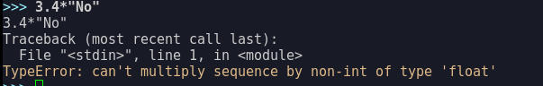
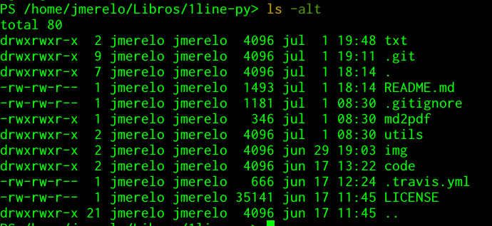

# Datos compuestos

Lo interesante de los ordenadores es la capacidad que tienen para
representar cualquier tipo de dato, sea cual sea su estructura. No
todos los datos son "atómicos": un número, una ristra secuencial de
letras. En matemáticas existen estructuras, como las matrices y
vectores, que están compuestas de datos más simples, números
reales. Los árboles son estructuras de datos que son capaces de representar
cosas tan diversas como un árbol genealógico o la estructura de un
edificio. 

Todos los lenguajes de programación, o la mayoría, son capaces de
trabajar con estas estructuras, con una forma de escribirlas o
sintaxis particular y unas funciones que permiten modificarlas o
combinarlas. Empezaremos por las

## funciones,

que especifican qué secuencia de operaciones se debe aplicar a un
elemento determinado. En Python, las funciones son datos como
cualquier otro, número o cadena, y se pueden definir usando `lambda`. 

```Python
(lambda dato: dato*dato)(3+4j)
(-7+24j)
```

Esta función va a usar `dato` para referirse a los valores que se le
van a pasar a la función; tras los `:` especifica la operación que va
a realizar sobre el mismo, que es a la vez el valor que va a
devolver. En este caso, multiplicarlo por sí mismo y devolver el valor. Los primeros
paréntesis, que, recordemos, sirven para agrupar operaciones, definen
esta operación sin nombre; los segundos paréntesis sirven para definir
el valor que se le va a pasar a la función definida. Esta función es
*pura*, tal como las funciones mátemáticas, en el sentido que toma un
valor, aunque podrían ser varios, y devuelve otro valor. No tiene
*efectos secundarios*: no cambia nada en el exterior, ni siquiera el
valor de las variables sobre las que trabaja. Recibe una copia de los
valores con los que se les llama, en lo que se denomina *paso por
valor*, y devuelve otro valor. Simple y elegante. 

A los lenguajes que tienen, aparte de la posibilidad de definir
funciones como datos *de primera categoría*, otra serie de
características, se les llama lenguajes funcionales. Python no es, en
realidad, un lenguaje funcional, aunque sí permite, como se ve,
definir variables de esta forma, que además es muy similar a como se
hace en Ruby:

```Ruby
( -> ( dato ) { dato* dato }).call( 3+0.1i )
 => (8.99+0.6000000000000001i)
```

En este caso, `->` es el símbolo que se usa, en vez de `lambda`, para
indicar que se trata de una función; la variable implícita va rodeada
por paréntesis y en vez de usar `:` para separar los parámetros del
código, Ruby usa `{}` para indicar que se trata de un bloque de
código. Quizás
por
[aquello de "sencillo es mejor que anidado"](https://hipertextual.com/2011/02/zen-python). ¿Para
qué *anidar* usando bloques, cuando `:` es capaz de separar
perfectamente el código de la definición? ¿Para qué usar paréntesis
para agrupar los parámetros? Finalmente, ¿por qué usar `call` como se
hace en Ruby si con los paréntesis ya está claro que se trata de una
llamada de función?

Ruby, como casi todos los lenguajes modernos, también tiene elementos
funcionales, simplemente porque hoy en día es difícil trabajar en
entornos de *cloud* y similares sin tener un modelo de programación
que se parezca más al funcional que a otra cosa. Pero hay lenguajes
funcionales, como Clojure, donde esto se ve de forma más explícita:

```Clojure
user=> ((fn [zipi zape] (str zipi " " zape)) "þor" "es poderoso")
"þor es poderoso"
```

Todos los lenguajes funcionales, por herencia de Lisp, tienen muchos
paréntesis. Qué le vamos a hacer. La forma de trabajar también es
peculiar. No separan la función de los datos a los que se van a
aplicar, simplemente todo forma una *tupla* o agrupación donde el
primer elemento de la tupla se va aplicando al resto de los elementos
creando algo. Empecemos por la izquierda, después del segundo
paréntesis abierto. Definimos una tupla con tres elementos: `fn`,
`[zipi zape]` y un tercero que es a su vez una tupla con cuatro
elementos, `(str zipi " " zape)`. Este último define en sí la función
que se va aplicar a `zipi` y `zape`, que son simplemente *ranuras* o
*marcadores* que van a ser rellenos por lo que se le pase a la
función. Pero estos tres elementos, rodeados por paréntesis, son a su
vez el primer elemento de otra tupla que incluye como 2º y 3º
elemento `"þor"` y `"es poderoso"`. El intérprete de Clojure tomará
esos dos elementos que se insertarán en los *marcadores* `zipi` y
`zape` y devolverá el resultado en la siguiente línea, como se ve.

Igual que en los 90 el estilo de programación orientado a objetos se
acabó imponiendo como convención incluso en los lenguajes no
orientados a objetos como C, el estilo funcional es uno de los
paradigmas predominantes en esta década y posiblemente al principio de
la siguiente. Conviene conocer los lenguajes de programación
funcionales, e intentar funcionar de forma funcional (broma totalmente
intencionada) en el resto de los lenguajes. Incluso en Python. 

Una función es una estructura compleja porque incluye definiciones de
parámetros y también código. Pero

## vectores, listas y otras estructuras secuenciales

almacenan grupos de datos que pueden tener alguna relación
entre ellas. Por ejemplo

```Python
["A1", 4+5j, lambda dato: dato*dato ]
['A1', (4+5j), <function <lambda> at 0x7fb4cb278a60>]
```

La primera cadena puede ser una cadena única que sirva para
identificar, la segunda un valor inicial, y la tercera una función que
se va a aplicar repetidamente para obtener el resultado. Los tipos son
diferentes, tan diferentes como se pueda ser, pero a Python le da
igual. Los corchetes `[]` al principio y al final son los que indican
que se trata de una lista y las comas separan cada elemento del
siguiente. 

Como todo en Python,
las
[listas son objetos](https://docs.python.org/2/tutorial/datastructures.html). Python
es un lenguaje orientado a objetos, lo que viene a significar que
cuando se define algo usando una sintaxis determinada, lleva aparejada
una serie de operaciones que se pueden hacer con él. A esas
operaciones se puede acceder usando un `.` y el nombre de la
función. Por ejemplo, queremos extraer el último elemento de la lista:

```Python
["A1", 4+5j, lambda dato: dato*dato ].pop()
<function <lambda> at 0x7fb4cb278a60>
```

devuelve `<function <lambda> at 0x7fb4cb278a60>`, la función que está,
efectivamente, en la última posición. Podemos acceder a cualquiera de
los elementos de la lista también usando corchetes:

```Python
["A1", 4+5j, lambda dato: dato*dato ][1]
(4+5j)
```

o incluso a un rango de ellos:

```Python
["A1", 4+5j, lambda dato: dato*dato ][0:2]
['A1', (4+5j)]
```

Sin embargo, para lo que lo hemos planteado, almacenar operaciones y
valores iniciales, es posible que esta estructura no sea la más
adecuada. Una vez que se han establecido los valores, lo normal es que
no se alteren. Si algún valor inicial cambia, se puede crear un nuevo
terceto. Es decir, puede ser conveniente que los valores sean
inmutables, que no
cambien. Las
[*tuplas*](http://openbookproject.net/thinkcs/python/english3e/tuples.html) representan
este tipo de dato que va a ser inalterable a lo largo de su vida. 

```Python
("A1", 4+5j, lambda dato: dato*dato )
('A1', (4+5j), <function <lambda> at 0x7faa8da8ee18>)
```

Aparentemente es igual, pero su tipo es `tuple` en vez de `list`. Se
puede usar `[]` de la misma forma para acceder a elementos
particulares, pero `pop` no va a funcionar; simplemente no tiene ese
método porque una vez creada una tupla es inmutable, sólo se puede
procesar y generar alguna otra cantidad. Esta distinción entre
*tuplas* y *listas* es peculiar de Python, pero en casi todos los
lenguajes existen estructuras de datos inmutables o mutables. De
hecho, en algunos lenguajes funcionales como Clojure algunas
estructuras de datos similares, las *colecciones*, son inmutables por
omisión y hay que usar funciones para hacer versiones mutables. Esta
sería una lista equivalente a la anterior (salvo por la ausencia de
números complejos como dato base):

```Clojure
'("A1" 3 (fn [dato] (dato*dato)))
```

El `'` al principio hace que la lista no se evalúe, porque toda lista,
siempre, se evalúa en Clojure. Y, como se ha indicado, esa lista no se puede modificar, como
las tuplas de Python, sólo se le puede evaluar o pasar a una función
para que genere una nueva lista. 

En los dos lenguajes y en los dos casos indicados, las listas pueden
tener elementos homogéneos o heterogéneos. En muchos casos vamos a
trabajar con elementos del mismo tipo, numéricos por ejemplo. Siempre
que vayamos a

## procesar listas,

como la siguiente:
```
list(range(10))
[0, 1, 2, 3, 4, 5, 6, 7, 8, 9]
```

que es una forma de indicarle a Python que queremos un rango de
valores que termina en el valor justo anterior al que le
pasamos, 10. Lo que ocurre es que un `range` es un objeto peculiar que
permite hacer ciertas cosas; nosotros necesitamos convertirlo en una
lista para poder trabajar con él fácilmente. Como generador de listas
de números, `range` es bastante flexible,
[pero es inmutable](http://www.mclibre.org/consultar/python/lecciones/python_range.html). Por
eso necesitamos convertirlo en un tipo mutable para poder trabajar con
él alterándolo *in situ*. 

Por ejemplo, esta expresión nos halla los números divisibles por 11
entre los 100 primeros:

```Python
list(filter( lambda by11: by11//11 == by11/11, range(100) ))
[0, 11, 22, 33, 44, 55, 66, 77, 88, 99]
```

y lo hace aplicando un filtro, que toma como argumentos una función,
que como vemos está creada a partir de una `lambda`, y los 100
primeros números con `range`. El resultado de `filter` es un objeto de
tipo `filter`, pero ese objeto se convierte fácilmente en una lista
simplemente usando `list()`, que efectivamente crea una lista a partir
del objeto en el argumento, siempre que esto sea posible, claro.

>*Ejercicio*: Listar todos los números que sean potencia de dos entre
>los 1000 primeros números. ¿Se puede usar una técnica parecida para
>las potencias de tres? 

Como generación de sucesiones una vez que uno tiene manera de decidir
si algo pertenece o no a la sucesión está bien, pero muchas veces lo
que buscamos es hacer algo con todos los elementos de una lista, para
obtener como resultado otra lista diferente. Este tipo de funciones se
llaman *maps*, que en realidad es el término inglés para *aplicación*
en el sentido matemático: una función que se aplica a una lista para
obtener otra lista diferente. Por ejemplo, vamos a representar los
números en una lista usando círculos, para hacer gráficas de
caracteres, por ejemplo.

```Python
list(map( lambda num: num*"●", [3,15,2,7,33]))
['●●●', '●●●●●●●●●●●●●●●', '●●', '●●●●●●●',
'●●●●●●●●●●●●●●●●●●●●●●●●●●●●●●●●●']
```

Como en el caso anterior, `map` crea un objeto de ese tipo, que
tenemos que convertir en lista usando list para que aparezca el
resultado de una forma legible. En este caso, para generar una cadena
con tantos círculos como el valor numérico que haya usamos la
multiplicación, `*` como repetición de cadenas. En este caso el
resultado es una cadena que repite la inicial tantas veces como
indique el número. A este reuso de símbolos siguiendo más o menos su
significado *natural* se le denomina **sobrecarga** de operadores. Un
operador está *sobrecargado* cuando se puede aplicar a diferentes
tipos con resultado que, siendo coherentes, son diferentes. `*` se
puede aplicar a números enteros dando un resultado entero, a reales y
enteros dando un resultado real, y a enteros y cadenas dando como
resultado una cadena. Esto no quiere decir que `*` funcione siempre;
si se trata de multiplicar por un número real, producirá un error. 



También se pueden usar funciones ya definidas por Python. Por ejemplo,
`len` devuelve la longitud de un objeto:

```Python
list(map(len,['●●●', '●●●●●●●●●●●●●●●', '●●', '●●●●●●●', '●●●●●●●●●●●●●●●●●●●●●●●●●●●●●●●●●'])
[3, 15, 2, 7, 33]
```

Que devolverá, de una forma retorcida, los número que había en la
lista original, tras medir el número de círculos en la cadena que es,
efectivamente, el mismo. Obsérvese que el primer argumento de map es
siempre una función. No le estamos pasando más que el nombre de la
función. Map llamará a esa función una vez por cada elemento de la
lista. 

`len` es una de las
pocas
[funciones de Python que están siempre disponibles](https://docs.python.org/3/library/functions.html). Una
de las frases del Zen de Python dice
que
[los espacios de nombres son una gran idea](https://www.python.org/dev/peps/pep-0020/) y
que habría que usar un montón de esos. Efectivamente, eso viene a
decir que es mejor meter funciones que no sean relativamente comunes
en espacios de nombres o módulos específicos, y dejar el espacio de
nombre "nulo", o el de funciones siempre disponibles, que no necesitan
prefijo, limpio con unas 70 funciones, muchas de las cuales son para
construir objetos y hemos visto ya, como `list`, `map` o `filter`.  


> *Ejercicio*: "Representar" de forma gráfica (usando caracteres) el
> logaritmo de las 20 primeras potencias de dos. 

[Haskell](http://haskell.org), que es un lenguaje funcional,
permite aplicar también estos `maps` con una sintaxis relativamente
directa

```Haskell
map (\rep -> concat $ replicate rep "#") [3,2,1]
["###","##","#"]
```

La definición de funciones en este caso se hace con un paréntesis. El
`\` inicial declara el representante de las funciones de la lista que
se le va a pasar. Además, en Haskell los argumentos de la función van
simplemente separados por espacios, así que `replicate rep "\#"`
replica `rep` veces el asterisco, `concat $` lo reúne en una sola
cadena, y por tanto, también de una forma un tanto complicada, crea
"barras" con almohadillas "#" de la longitud de los diferentes
elementos de la lista que se le pasa. 

Haskell, como todos los lenguajes como los que hemos trabajado, tiene
un REPL que se ejecuta desde la línea de órdenes, así que quizás
convenga también 

## aprender unas cuantas órdenes

que permiten trabajar con la misma. Estas órdenes corresponden al
`shell` de Linux, que funciona, aunque posiblemente en una versión más
antigua, en los Mac, y tienen también un equivalente en el [PowerShell](https://www.tecmint.com/install-powershell-in-linux/),
la herramienta de administración libre de Microsoft. Va a haber unas
cuantas cosas que necesites hacer saliendo de la comodidad de un
interfaz gráfico. En muchos casos va a ser más rápido y, sobre todo,
teniendo en cuenta que todas las órdenes que ejecutas se quedan
almacenadas en la historia del intérprete, mucho más repetibles. Ya
hemos visto anteriormente cómo navegar por la línea de órdenes, ahora
algunas órdenes útiles que funcionan en todos los intérpretes:

* `grep` busca en ficheros. Es muy útil para ver, por ejemplo, dónde
  se ha usado alguna función y copiar/pegarla a un nuevo lugar, que es
  como se avanza el tema. `grep str *.md` usa además el comodín `*`,
  que se refiere a cualquier cadena de caracteres de cualquier
  longitud. En este caso, buscaría la cadena `str` en todos los
  ficheros con la extensión `md`. Se pueden buscar también frases,
  `grep "TypeError: must" *` buscará exactamente esa frase; la única
  diferencia con el caso anterior es que rodeamos la cadena que se
  busca con comillas para que se busque íntegra.
  
* Se pueden crear directorios con `mkdir` y borrarse con `rmdir`. 

* La orden `find` también es muy útil. Tratamos de buscar el
  directorio donde metimos el dichoso fichero de Python, pues `find
  . -name *.py -print`. En realidad en PowerShell sólo busca en el
  directorio actual, pero en Linux descenderá por todos los
  directorios a partir de `.`, el directorio actual.
  
* `ls` lista todos los ficheros y directorios del directorio actual,
  incluyendo `.` y `..`, y `ls -alt` los muestra con permisos y los
  ordena por fecha de modificación.
  


DuckDuckGo, el buscador para
programadores,
[te da una chuleta de shell](https://duckduckgo.com/?q=shell+cheatsheet&t=canonical&ia=cheatsheet) directamente
a la hora de buscar,
también
[de PowerShell](https://duckduckgo.com/?q=powershell+cheatsheet&t=canonical&ia=cheatsheet&iax=1). La
puedes tener como referencia a si quieres saber cómo se hace cualquier
otra cosa. Los dos shells son muy potentes, y permiten crear programas
potentes y expresivos. Conocerlos bien es un gran complemento al uso
de cualquier lenguaje de programación.


