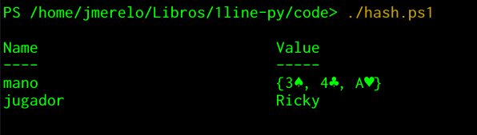
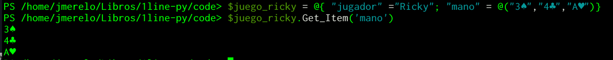

# Dando nombre a las cosas

En los lenguajes de programación hay tantos objetos que hay que
dividir el espacio de todos los nombres posibles para poder usar
nombres cortos y razonables, siempre que tengan un prefijo que aclare
el contexto. A estos prefijos se les llama *espacios de nombres* o
*namespaces*, y suelen estar definidos en módulos, ficheros que
contienen funciones relacionadas, a veces con una estructura que
permite crear objetos de ese tipo.

Los espacios de nombres, precisamente, preceden a los
identificadores. Ya hemos visto algunos de estos, los que se usan para
designar a las funciones. Pero ya va siendo hora de que conozcamos a
nuestras amigas

## Las variables

Las variables almacenan objetos que vamos a usar más adelante;
permiten hacer expresiones más claras y concisas y no tener que
recalcular continuamente valores. Ya hemos visto una, `_`, que
almacena el último valor calculado en el intérprete. También otras
variables como las que se usan en expresiones `lambda`, que más que
para almacenar sirven para representar valores que se le pasan a una
expresión, aunque tienen la misma forma sean para representar o para
almacenar.

El asunto de darle nombre a un objeto o
expresión
[no es baladí](https://www.python.org/dev/peps/pep-0008/#naming-conventions). Aunque
se pueden usar mayúsculas o minúsculas combinadas con `_`, se aconseja
no usar ni `l` ni `O` ni `I` porque seguro que habéis tenido que estar
un momento pensando si se trata de un 0 o de un 1. El `_` es una forma
conveniente de separar palabras en una variable, sustituyendo al
espacio, de forma que se preferirá `es_primo` a `esPrimo`. Esta última
convención se suele denominar *CamelCase* y conviene evitarla [por diversas razones](https://whathecode.wordpress.com/2011/02/10/camelcase-vs-underscores-scientific-showdown/).

Las variables deben ser también descriptivas, como la siguiente:

```Python
cifras_de = lambda numero: len(str(numero))
potencias_de_2 = map( lambda num: 2**num, range(20))
list(map( cifras_de, potencias_de_2 ))
```

Estas definiciones, aparte de
cumplir
[el hecho de que la legibilidad cuenta](https://www.python.org/dev/peps/pep-0020/),
también usa un `map` sin convertirlo en lista previamente;
efectivamente, `map` se puede aplicar
a
[secuencias de diferente tipo](http://www.bogotobogo.com/python/python_fncs_map_filter_reduce.php). Finalmente
convertimos el resultado a `list` por legibilidad. En este caso lo que
estamos haciendo es hallar las cifras de una serie compuesta por las
20 primeras potencias de dos. Para hallar las cifras de un número lo
convertimos a una cadena con `str` y a continuación hallamos la
longitud de esa cadena con `len`.

Trabajando con el REPL, las variables definidas se quedan en el mismo
hasta que terminemos, y podemos usarlas en cálculos más adelante. Y,
evidentemente, igual que las constantes que hemos venido usando, y
como se ha visto al principio, tienen un tipo que se les asigna
automáticamente.

```Python
type(potencias_de_2)
<class 'map'>
```

Sin embargo, Python es un lenguaje de tipado dinámico:
```Python
potencias_de_2=(2,4,8,16,32)
type(potencias_de_2)
<class 'tuple'>
```

En el momento que se le vuelva a asignar un valor a la variable, el
tipo cambia. En este caso se tratará de una *tupla*, que es también
una secuencia y por tanto se le puede aplicar la función `map`
anterior, pero en este caso una tupla es *inmutable*.

```Python
potencias_de_2.insert(64)
Traceback (most recent call last):
  File "<stdin>", line 1, in <module>
AttributeError: 'tuple' object has no attribute 'insert'
```

Sin embargo, se puede hacer:
```Python
potencias_de_2 = list( potencias_de_2)
potencias_de_2.insert(len(potencias_de_2),64)
```
cambiando el tipo y reasignándoselo a la misma variable, y finalmente,
para recuperar el valor de una variable, simplemente se escribe su
nombre en el REPL:

```Python
potencias_de_2
[2, 4, 8, 16, 32, 64]
```

donde se puede ver que, al tratarse de una lista y no una tupla, usa
los corchetes y no los paréntesis.

> *Ejercicio*: Calcular los múltiplos de 3 entre los 100 primeros
> números naturales. ¿Qué tipo de estructura de datos podemos usar?
> ¿Cómo se averigua, con un test simple, si es un múltiplo de tres?
> ¿Se puede modificar la secuencia de operaciones anterior para
> detectar múltiplos de 9?

Seguramente se te habrán ocurrido varias formas de hacer lo
anterior. Una más directa, parecida a como se ha hecho antes, alguna
menos directa. A calcular cuanto tiempo se tarda en realizar una
operación se le llama hacer *benchmarking* y todos los lenguajes de
programación vienen preparados para ello. Veremos como

## Medir la velocidad en Python

Pero primero vamos a ver cómo trabajar con Python desde la línea de
órdenes. Cuando trabajamos en el REPL, se trata de un bucle en el que
la `P` significa "imprimir", por lo que no nos tenemos que preocupar
de eso; sin embargo, cuando tratamos de ejecutarlo desde la línea de
órdenes del sistema, símbolo del sistema o como lo llames de forma
habitual, siempre tendrá que estar envuelto en una orden `print`:

```bash
python -c "print(list(map(lambda n: n/2 == n//2, \
  range(1000))))"
```

Eso va a lanzar a la pantalla una buena cantidad de `True`s y `False`s
así que es mejor que los separemos con retornos de carro, es decir, un
carácter que ponga cada resultado en una línea

```bash
python -c "print('\n'.join(map(lambda n: str( n/2 == n//2 ), \
  range(1000))))"
```

donde usamos `join`, un método de `str` al que se le pasa una
secuencia de cadenas; por eso hemos modificado ligeramente el `lambda`
para que el resultado de la prueba se pase a una cadena con `str`. De
hecho, en este programa definimos la función `lambda` para todos y
cada uno de los elementos del `range`. No demasiado bueno. Vamos a
*sacarlo fuera del bucle*, y definirlo una sola vez:

```bash
python -c "es_par = lambda n: str(n/2 == n//2); \
  print('\n'.join(map(es_par, range(1000))))"
```
Hemos definido la función `es_par`, pero ahora nos encontramos con dos
órdenes seguidas. Para que el intérprete lo entienda, las separamos
con punto y coma. En Python se pueden separar todas las sentencias con
`;`, pero realmente sólo es necesario cuando están en la misma línea,
como se verá más adelante.

Ahora cabría pensar si merece realmente la pena hacer esto. Es
ligeramente más legible, lo que *está bien* desde el punto de vista de
Python, pero ¿ganamos algo de velocidad?

Una forma de hacerlo es mediante el módulo `timeit`. Los módulos son
*espacios de nombres*, el sentido que crean un prefijo para las
funciones que incluyen. Tampoco se "cargan" por omisión, con lo que no
ocupan memoria; hay que cargarlos explícitamente. Python es
minimalista en el número de funciones que incluye, así que en este
caso tenemos que trabajar con este módulo, que afortunadamente es uno
de los incluidos en el *core*, o entre los ficheros que se
distribuyen de forma habitual con el intérprete de Python. `timeit`
hace un *benchmark*, ejecutando una serie de órdenes repetidamente y
dándonos la temporización. Y lo podemos usar directamente desde la
línea de órdenes, de la forma siguiente:

```
python -m timeit -s "print('\n'.join(map(lambda n: str( n/2 == n//2 ),
range(1000))))"
```

lo que ejecutará el programa; con `-m` se le indica el nombre del
módulo que estamos importando y con `-s`, que significa *setup*, lo
que vamos a ejecutar. Finalmente dará un resultado de este
estilo:

```
100000000 loops, best of 3: 0.00571 usec per loop
```

Podríamos, en principio, usarlo así para ver qué es más conveniente,
si una u otra forma. Aunque a priori cabría pensar que la forma en la que
no se crea una función cada vez que se ejecuta un bucle es más rápida,
ejecutando eso nos va a dar más o menos el mismo resultado, que de
hecho es el resultado que se obtiene prácticamente para todo. En este
caso, para funciones tan simples, no resulta realmente demasiado
útil.

Probaremos desde el REPL, a ver si obtenemos algo más
razonable. Importamos el módulo y la función del mismo que
necesitamos.

```Python
from timeit import timeit
```

Y vamos a medir las dos formas (incluyo `\` para indicar continuación
de la línea, puede teclearse en la misma línea si es necesario):

```Python
timeit(setup="map(lambda n: str( n/2 == n//2 ), range(1000))")
0.006306399000095553
timeit(setup="es_par = lambda n: str(n/2 == n//2); \
  map(es_par, range(1000))")
0.006795324999984587
```

La diferencia parece no ser demasiado grande, y lo que esperábamos que
fuera más rápido, la segunda forma, es en realidad más lento. Pero
algo importante en la medición es que las cosas no tienen por qué ser
de la misma forma para todos los valores. Multipliquemos por 10 el
número de elementos:

```Python
timeit(setup="es_par = lambda n: str(n/2 == n//2); \
  map(es_par, range(10000))")
0.006140023999250843
timeit(setup="map(lambda n: str( n/2 == n//2 ), range(10000))")
0.008905056998628424
```
El panorama cambia bastante, con la primera forma, como era de
esperar, un 25% más rápido. Al empezar a usar números más grandes, sí
importa el número de veces que se define. Incluso podemos probar otro
test de *paridad*

```Python
timeit(setup="es_par = lambda n: str(n^1 == 0); \
  map(es_par, range(10000))")
0.006006274999890593
```

que es un poquitín más rápido... En todo caso conviene repetir varias
veces las operaciones. Estas operaciones son tan rápidas que realmente
no merece la pena optimizar mucho salvo que se ejecuten miles de
millones de veces. La optimización prematura es la madre de todos los
vicios, y
como
[ahora es mejor que nunca](https://www.python.org/dev/peps/pep-0020/),
tener código suficientemente rápido y legible es
mejor que buscar, hasta el infinito y más allá, otra manera de hacer
que sea un 10% más rápido. Una vez más, si ésta no es una
función crítica donde el sistema pasa el 90% del tiempo no vale la pena optimizar.

En muchos casos, la mejor forma de optimizar es simplemente plantear
algoritmos de otra forma. Por ejemplo, usando

## Recursión

Se habla de recursión cuando una función se llama a sí misma. En
programación funcional, resolver un problema usando recursión es la forma *normal* de hacer las cosas,
suplantando la repetición. Uno de los principios de este tipo de
programación es que las funcionen no tienen efectos secundarios; con
la recursión se consigue *pasar* el estado como parámetro de una
función sin tener que *guardarlo* en ningún momento.

En general, las funciones recursivas trabajan de la forma
siguiente. Se compara el parámetro con el que marca el final de la
recursión, que pueden ser uno o varios. Si es así, se devuelve el
resultado. Si no, se llama a la función de nuevo con el parámetro
procesado de alguna forma. Cuando se llega al final, se deshace la
recursión y se devuelve el resultado.

La recursión funciona gracias a una estructura llamada [*pila* o *stack*](https://en.wikipedia.org/wiki/Stack_(abstract_data_type)). Una
pila es una lista en la cual hay definidas sólo dos operaciones:
añadir al final de la pila y extraer el último elemento
añadido. Realmente, no existen las pilas en Python, pero podemos usar
las listas, que son estructuras mutables, para ello

```Python
>>> fibonacci = [1,1,2,3]
fibonacci = [1,1,2,3]
>>> fibonacci.append(5)
fibonacci.append(5)
>>> fibonacci.pop()
fibonacci.pop()
5
>>> fibonacci
fibonacci
[1, 1, 2, 3]
```

Cuando usamos una función que se llama a sí misma o recursiva, estamos
haciendo esto, en realidad; sólo que es el propio lenguaje el que se
encarga de llenar y posteriormente vaciar la pila. Así que vamos a
crear una función de este tipo para averiguar si una cifra es múltiplo
de tres lo que, recordando aritmética de primaria, resulta de sumar
las cifras repetidamente hasta que resulta una sola, en cuyo caso será
múltiplo de tres si la cifra resultante es 3 o 9.

```Python
suma_cifras = lambda n:  sum(map(int,list(str(n))))
def is_multiple_of_3(n): sum = suma_cifras(n); \
  return is_multiple_of_3(sum) if (sum >= 10) \
  else (True  if (sum==3) or (sum==9) else False)
```

Tenemos también dos formas diferentes de definir funciones. Primero,
usando `lambda`. Para sumar las cifras tenemos que convertir primero
el número en una cadena con `str`, luego la cadena en una lista de
caracteres que representan cifras, pero que tendremos que volver a
convertir en números para poder sumarlos. Una vez más, se hace uso de dos
técnicas de pensamiento computacional: buscar la representación
adecuada para los datos, y crear la división de una operación en tres pasos (y
eso en una sola línea).

La recursividad se usa en la siguiente línea. Y es aquí donde tenemos que usar la
forma tradicional de definir funciones de Python: `def`, porque con el
uso de `lambda` no se permite recursión. En todo caso, es una forma más compacta
de definir la función; `lambda` se usa generalmente para funciones a
las que no se le quiere asignar un nombre, así que asignarle un nombre
viene a ser un contrasentido; úsese sólo en caso de que sea más fácil
de comprender que la forma alternativa o se pueda definir en una sola
línea. Tras el nombre de la función `is_multiple_of_3` ponemos entre
paréntesis el parámetro que vamos a usar en la misma y, como
anteriormente, órdenes separadas por `;`.

La primera halla la suma de las cifras.
La segunda usa la construcción Resultado `if` cierto `else` lo que
sea. Lo usa de forma anidada, lo que vuelve a contravenir, igual que
la definición de la función en una sola
línea,
[la guía de estilo que desanima el uso de sentencias compuestas](https://www.python.org/dev/peps/pep-0008/),
pero
[lo práctico le gana a la pureza](https://hipertextual.com/2011/02/zen-python) y
estamos tratando de condensar todo el Python posible en una sola
línea, así que se perdona esta pequeña digresión, sobre todo porque la
recursión queda más evidente. Si tiene más de una cifra (mayor que
10), se sigue aplicando de forma recursiva. Si no, ya podemos
comprobar si es o no múltiplo de 3: ¿es 3 o 9? Se devuelve `True`;
o `False` en caso contrario. El `return` al principio de la llamada
recursiva es el que finalmente recoge el resultado. Al trabajar en el
REPL habrá que pulsar ⤶ para indicar que termina ahí.

> *Ejercicio*: usar una función recursiva para calcular el factorial
> de un número. ¿Habría alguna otra forma de hacerlo? ¿Cuál es más
> rápida para números pequeños? ¿Y para números más grandotes?

Podemos usar también recursión para calcular elementos de una sucesión
que se defina de forma recursiva. En algunos lenguajes hay formas más
compactas de hacerlo, por ejemplo en [Groovy](http://groovy-lang.org)
definiríamos de esta forma el n-ésimo elemento de la sucesión de
Fibonacci

```Groovy
def fib(n) {n<2 ? 1 : fib(n-1)+fib(n-2)}
```
que usaría la suma de los dos elementos anteriores para calcular el
elemento enésimo, y el operador ternario `?:`, que está presente en la
mayoría de los lenguajes y que es similar al `if-else` en una sola
línea de Python, con ? equivalente a `if` y `:` a `else`, aunque en
otro orden: la comparación no es el segundo elemento, sino el
primero. En este caso, si n es menor que dos se devuelve uno, si no se
hace una llamada a la función sumando los dos elementos anteriores.

> *Ejercicio*: usando una función recursiva equivalente a la anterior
> en Python, calcular los 20 primeros elementos de la sucesión de
> Fibonacci. ¿Hasta que número es más o menos razonable hacerlo de
> esta forma?

Te estarás preguntando si todas estas líneas son solo bytes, y se
perderán como lágrimas en la lluvia cuando se apague el
ordenador. Pues sí, pero no tiene por qué ser así si usas

## GitHub

Ya te indicamos al principio de todo que era un buen momento para
registrarse en GitHub, pero ibas muy liada y no nos hiciste
caso. Vale, pues ahora *sí* que lo es, porque lo vamos a usar para
publicar todas estas líneas que vas elaborando como ejercicios y poder
enseñárselas al profe y al ancho mundo.

[GitHub](https://github.com) es un portal de desarrollo colaborativo
de software que usa `git` como herramienta de control de
fuentes. Aunque siempre es buen momento
de [aprender git](http://amzn.to/2uuz27h), por lo pronto apenas si
usamos ficheros, así que vamos a usar una de las funciones de este
sitio, los llamados [*gists*](http://gist.github.com), donde se pueden
alojar desde textos a pequeños trozos de programa explicados, como los
que podéis estar haciendo en este curso o siguiendo este manual.

Se puede usar eligiendo un nombre de fichero y copiando y pegando el
contenido en el sitio correspondiente; el fichero se puede comentar
usando el formato de comentarios del lenguaje correspondiente, por
ejemplo, comenzando la línea con `#` en Python (y para el caso,
también en Perl y Ruby).

>*Ejercicio*: subir a gist.github.com alguno de los ejercicios creados
>anteriormente, usando comentarios para explicarlo. Difundirlo también
>por Twitter, con la etiqueta #1linepy, enlazándolo.

Por otra parte, también se pueden incluir en un repositorio de GitHub
normal, que es el nombre que reciben los proyectos. Los repositorios
públicos son gratuitos en GitHub, y crearlo es tan fácil como elegir
una licencia, el lenguaje que se va a usar y crear un fichero
`README.md`.

El fichero `README.md` está en un lenguaje de marcas simplificado
llamado [Markdown](https://es.wikipedia.org/wiki/Markdown), como, por
otra parte, está escrito este mismo manual. Sin necesidad de saber
HTML, el lenguaje de las páginas web, y con marcas simples como `#` para un titular de primer orden o
rodear una palabra con `**` para indicar que va a estar en cursiva, se
pueden crear páginas con una tipografía adecuada, con inclusión de
código, incluso tablas y algunas cosas más avanzadas, sin necesidad de
usar lenguajes más complejos como HTML o un procesador de
textos. Usando programas como `pandoc` o, en muchos casos,
directamente incluido en el editor, se puede generar HTML o incluso
PDF a partir del
original. [Las marcas son fáciles de recordar, y GitHub tiene un *sabor* especial](https://guides.github.com/features/mastering-markdown/),
que se puede usar dentro de sus páginas. Cualquier fichero en Markdown
incluido en un repositorio GitHub aparecerá convertido a HTML y con la
apariencia que corresponda a las marcas incluidas.

>*Ejercicio*: Alternativamente a los gist, crear un repositorio en
>GitHub con los ejercicios, cada uno en un fichero correspondiente, y
>con un enlace y explicación en el `README.md` creado. Una vez más,
>difundir por Twitter con `#1linepy`

Realmente va a ser conveniente que usemos este tipo de repositorios
cuando trabajemos con estructuras de datos más, complejas, como los

## Conjuntos y diccionarios

Comencemos con los que se denominan *diccionarios*, aunque en otros
lenguajes se les llama *arrays* asociativos o tablas *hash*. Los
diccionarios están compuestos por pares clave-valor; la clave es una
cadena, el valor puede ser cualquier cosa.

```Python
juego = { 'jugador'   :'Johnny',
         'mano'      : ['5♠','Q♣','8♥'],
		 'estrategia': lambda mano: min(mano) }
```

Esta variable contiene información sobre una mano
de [brisca](https://es.wikipedia.org/wiki/Brisca) de un jugador, el
Johnny, cuya estrategia está representada por una función `estrategia`
que siempre saca el mínimo de todas las cartas. No es una buena
estrategia, pero una mejor no cabría en esa línea. El formateo se ha
incluido simplemente para que sea un poco más visible, pero no tiene
ninguna importancia en la sintaxis. En este caso.

De la misma forma que en las listas se accede al contenido iterando
de elemento en elemento, en este caso accederemos por la `clave` para
cada contenido: `juego['jugador']` nos devolverá `'Johnny'`, e igual
con el resto de elementos del diccionario.

Se puede considerar un diccionario una lista en la que cada elemento
es un par clave, valor. De hecho, [el método `items`](https://stackoverflow.com/questions/12229064/mapping-over-values-in-a-python-dictionary) de la clase te los
representa de esa forma:

```Python
juego.items()
dict_items([('jugador', 'Johnny'), \
  ('mano', ['5♠', 'Q♣', '8♥']), \
  ('estrategia', <function <lambda> at 0x7fcd3e298a60>)])
```
Evidentemente, los diccionarios son, exactamente igual que cualquier
otro objeto en Python, *representantes* o, de forma más precisa,
*instancias* de una clase, y por eso sólo por el hecho de ser creados
de una forma determinada tienen una serie de métodos que se pueden
usar sobre ellos. En este caso incluyen datos y también una función
que se puede aplicar sobre los mismos, así que podemos definir
funciones de esta forma:

```Python
def juega( mano ): return mano['estrategia'](mano['mano'])

```

que directamente aplicaría la "estrategia" que hayamos decidido, y que
está incluida en la estructura de datos, a la mano que cada jugador
tenga. Nota que debe haber una línea en blanco para que el intérprete
sepa que se ha acabado la definición de la función. En este caso:

```Python
from random import random
juego_ricky = {
  'jugador'   :'Ricky',
  'mano'      : ['3♠','4♣','A♥'],
  'estrategia': lambda mano: mano[int(random()*len(mano))] }

juega(juego_ricky)
'3♠'
juega(juego_ricky)
'A♥'
```

Como hay un ``random()`` en la estrategia, la carta resultante será
una aleatoria de entre las que Ricky tenga en su mano.

> *Ejercicio*: diseñar una estructura de datos para sucesiones
> matemáticas que contenga el nombre de la sucesión, el elemento
> inicial, y la función para calcular el siguiente elemento. Diseñar
> también una función que efectivamente calcule el siguiente elemento
> a partir del valor inicial.

En general, todos los lenguajes de programación que no son dinosaurios
como el C suelen tener esta estructura de datos. Incluso lenguajes
específicos de dominio como el que incluye PowerShell. Este script,
por ejemplo, define una tabla hash o diccionario:

```PowerShell
$juego_ricky = @{ "jugador" = "Ricky"; "mano" = @("3♠","4♣","A♥")}
$juego_ricky
```

Que resulta en algo así en PowerShell:



En vez de usar directamente los corchetes para recuperar el valor
asociado a una clave, PowerShell usa `Get-Item`:



Sobre la estructura de datos anterior, podríamos preguntarnos si
realmente hace falta que la mano de cartas esté en una lista. Una
lista está ordenada, tiene un primer elemento y un último y el resto
tiene un elemento delante y otro detrás. Una mano de cartas no tiene
por qué estarlo. Son diferentes elementos que se pueden ordenar como
uno quiera, o de ninguna manera. ¿Por qué no usar un conjunto? Los
conjuntos o `sets` en Python se caracterizan precisamente por no estar
ordenados:

```Python
mano_ricky= set( ['3♠','4♣','A♥'] )
```

En este caso hay que usar una palabra clave `set` para aclarar que se
trata de este tipo de estructura de datos, pero también podríamos
haber usado llaves, exactamente igual que con los diccionarios.
Se puede comprobar si un elemento pertenece o no a un conjunto:

```Python
'3♠' in mano_ricky
True
```

> *Ejercicio*: generar una baraja de cartas y una función que extraiga
> una mano de 3 cartas de ella.

Los conjuntos
tienen
[las operaciones típicas en ellos](https://www.learnpython.org/en/Sets).
Por ejemplo, si Ricky sospecha que Johnny se ha sacado una carta de la
manga, hallará la intersección entre las dos:

```Python
mano_johnny= set( ['7♣', '7♥', '7♦'] )
mano_johnny.intersection(mano_ricky)
set()
```

que devuelve, afortunadamente, un conjunto vacío, permitiendo que
sigan pacíficamente con su juego, su Bourbon y sus pretzels. Ahora
Johnny juega el 7 de corazones:

```Python
mano_johnny - {'7♦'}
{'7♥', '7♣'}
```

Ricky juega el 3♠, que es muestra, así que se lleva la mano. Como los
dos tienen ahora dos cartas, tienen que coger del mazo:

```
from random import choice
mano_johnny = mano_johnny | { choice(baraja) }
```

Una vez más, usamos una función del módulo `random` que elige un
elemento de un conjunto de cosas, en este caso una baraja. De hecho,
siendo la brisca habría sido mucho mejor hacerlo así

```
mano_johnny = mano_johnny | { baraja.pop() }
```

porque el mazo es un ejemplo de pila, ya que sólo se puede tomar la
carta superior, que es lo que se hace con `pop`. Usando `|`, que
representa en este caso la unión entre conjuntos, se genera un
conjunto de un solo elemento, como arriba, poniendo llaves alrededor y
se une a la mano de Johnny. Ha sido un 10♦, eso es suerte, aunque como
dicen en *The Gambler*,

>Cada mano es ganadora, cada mano es perdedora.

## Concluyendo

Tenemos una serie de estructuras de datos más con las trabajar y
representar una serie de problemas, sean listas, datos que no son
homogéneos y a los que se le puede asignar un significado para mejorar
su comprensión y tratamiento, incluso conjuntos para representar
aquellos grupos de objetos que no tengan ninguna relación entre sí más
que la igualdad de su pertenencia al mismo grupo.

Todos los objetos tienen sus propias operaciones, y amplían la
capacidad de abstracción de los problemas que se pueden resolver. Como
dicen también en *The Gambler*,

>Si quieres jugar al juego, debes aprender a jugar bien.

En este caso, debes aprender cómo trabajar con las diferentes
estructuras de datos y cuál es la más adecuada en cada caso. Y en caso
de duda, mide tiempos y sigue el Zen de Python.
