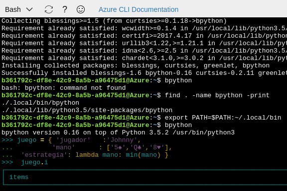

# Pilas no incluidas

El enfoque minimalista de Python hace que sólo haya disponibles en el
espacio de nombres principal, es decir, sin prefijos, una serie de
funciones, menos de 100. Ya hemos visto otras funciones, `timeit` y
`random` que, aunque no estén *cargadas* por defecto, sí se pueden
usar directamente siempre que las importemos en nuestro espacio de
nombres. 

Afortunadamente, el hecho de que Python sea software libre hace que se
cree todo un ecosistema alrededor del mismo, con funciones que no
están incluidos en el lenguaje, pero que añaden funcionalidad al
mismo. Estos módulos generalmente están o en un repositorio, o
referenciados en un directorio central de forma que se especifica
desde dónde se descargan y qué otras dependencias tienen que cargarse
antes de ser instalados.

En el caso de Python3, `pip3` es la herramienta que se usa. Se instala
junto con el intérprete, y permite tanto buscar, como instalar, como
actualizar *in situ*

Vamos a usarla para trabajar con

## `bpython`

`bpython` es un intérprete alternativo de Python que permite trabajar
con él de forma más agradable, con una serie de *goodies* como
sintaxis coloreada, completado automático de órdenes y variables, y
también información interactiva. Vamos a instalarlo con

```shell
pip3 install bpython
```

Se ejecuta usando `bpython` desde la línea de órdenes y el resultado
es algo así:

.

Entre otras cosas, este *shell* nos ayuda a insertar fácilmente los
métodos de un objeto determinado simplemente añadiendo un `.` al final
del objeto: aparecen todos los métodos que tiene. En el
	caso de la `baraja` que hemos mostrado en la imagen anterior, nos
	mostrará una serie de métodos que podemos seleccionar pulsando el
	tabulador; cuando seleccionamos uno y añadimos un paréntesis,
	`bpython` nos explicará cuales son los parámetros que toma esta
	función, lo que nos ahorra bastantes viajes a StackOverflow.
	
Vamos a usar a partir de ahora `bpython` para el resto del capítulo, y
posiblemente del libro, así que conviene que esté convenientemente
instalado a partir de este momento. Adicionalmente, eso significará
que tienes permisos para instalarte cosas, sin el cual el resto del
capítulo tampoco va a tener mucho sentido. 

Pero es posible que no tengas acceso a ningún ordenador de forma
permanente. Estos tiempos bárbaros en los que la gente tiene acceso a
cientos de ordenadores, pero ninguno de ellos tiene teclado o acceso
de administrador, crean esas cosas. Así que nos tendremos que
trasladar a 

## la nube.

en una primera, y quizás mala, aproximación, la nube son recursos
administrados por empresas que se pueden usar pagando sólo por el uso
que se les da. Pero para lo que nos ocupa, son ordenadores que podemos
usar desde cualquier navegador u ordenador y que en muchos casos se
pueden usar de forma limitada gratis; por ejemplo, por un mes o
siempre que el consumo de recursos no exceda una cantidad determinada.

Aunque las empresas que proveen la gama completa de soluciones en la
nube es relativamente pequeña, una de las que nos puede proporcionar
una cierta cantidad de recursos por valor de 50$ y por un mes es
[Azure de Microsoft](http://azure.com). No necesita ningún tipo de
tarjeta de crédito para darse de alta en la evaluación gratuita, pero
si estás en un centro de enseñanza es posible que tengan créditos
gratis.

También para experimentar puedes usar [Cloud9](http://c9.io). Aunque
es en realidad un entorno de desarrollo colaborativo, permite acceder
a la línea de órdenes desde el navegador, lo que nos permitirá
trabajar con ella fácilmente, aunque sea por un tiempo limitado. Te
puedes dar de alta, eso sí con una tarjeta de crédito, y usando tu ID
de GitHub. Una vez dado de alta, se crea un *workspace* en Python con
el nombre que uno quiera y automáticamente, con los ficheros y demás,
aparece abajo una terminal desde la que se puede ejecutar el REPL de
python y alguna cosa más. Se usa 

```
sudo pip3 install bpython
```

por ejemplo, para instalar el CLI con el que vamos a trabajar. 


.

El sistema de ficheros que se usa en Cloud9 es persistente, así que
también puede ser útil para dejarlos de forma permanente; únicamente
los ficheros con los que se trabaja son públicos. Puedes crear también
espacios privados y compartirlos con otros usuarios, de forma que se
puede trabajar colaborativamente sobre el mismo proyecto e incluso el
mismo fichero. Usar Cloud9 sólo como un sitio con una CPU gratuita es
no aprovechar todas sus posibilidades, pero también es cierto que
introduciéndolo de esta forma se puede ir aprendiendo, poco a poco,
todo lo que ofrece.

En sitios como Azure, Amazon o Google Compute Engine, sí puedes crear
máquinas virtuales completas. En Azure se pueden buscar máquinas
virtuales que tengan alguna característica determinada, como Python +
Linux y aparecen unas cuantas, sobre todo enfocadas a ciencia de
datos; también se pueden instalar directamente máquinas como Ubuntu
Server o Red Hat Enterprise Linux; cualquiera de ellos incluye Python
como herramientas por defecto.

Sin embargo, no es necesario ni siquiera instanciar una máquina
virtual para trabajar con Python desde el navegador. Desde mayo de
2017, Azure incluye el *Cloud Shell*, un intérprete Linux en el
navegador que, aunque sirve esencialmente para poder crear scripts de
Azure, también tiene un usuario Linux con el que se puede trabajar. No
hay, sin embargo, acceso a super usuario, por lo que tenemos dos
opciones:

* Instalarlo como usuario, con lo que habrá que usar

```
pip3 install --user bpython
```

y posteriormente añadir 

```
export PATH=$PATH:~/.local/bin
```

desde el shell para que se pueda usar directamente, o bien, como se ha
indicado en el primer capítulo, instalar `pyenv` para tener la versión
de Python que se desee. `bpython` en esta instalación irá así:



Este *cloud shell* se desactiva y se borra a los 10 minutos de
inactividad. Si realmente quieres conservar lo creado, o la historia,
es mejor que uses una máquina virtual real, que tendrás que recordar
apagar al final de cada sesión, porque todo consume y el crédito
gratuito que se obtiene no es mucho. 

Ya no tienes excusa para empezar a trabajar con `bpython` en la nube o
donde sea. Así que vamos a ver el 

## Python más funcional,

en el sentido de la palabra: cómo trabajar con diferentes estructuras
de datos siguiendo, dentro de lo posible, los preceptos de la
programación funcional. 

